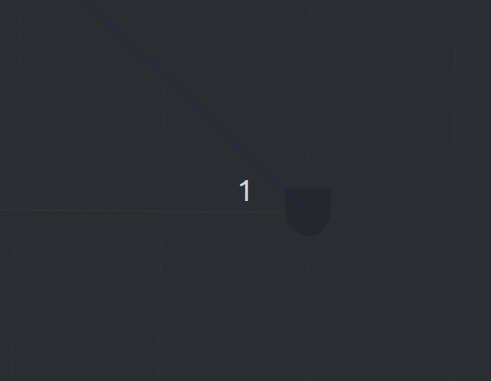
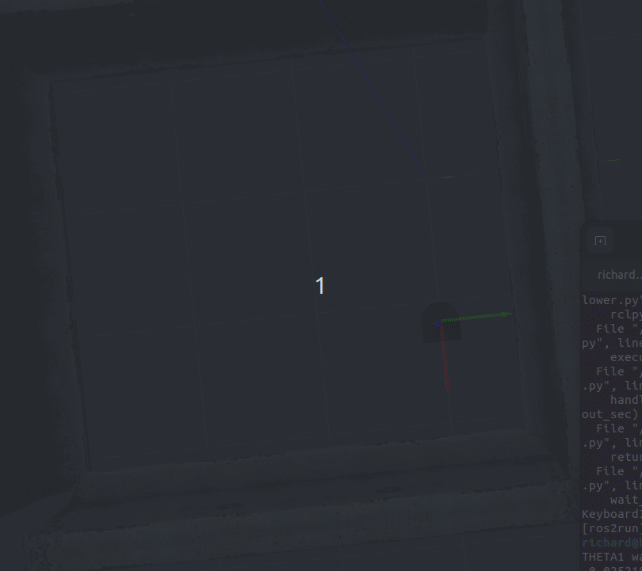
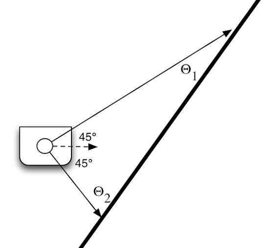
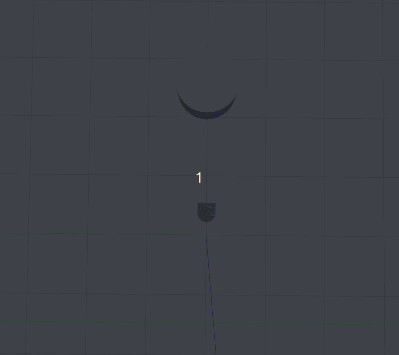
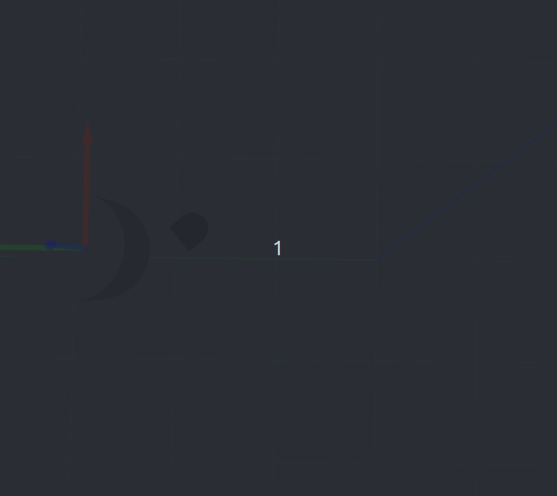
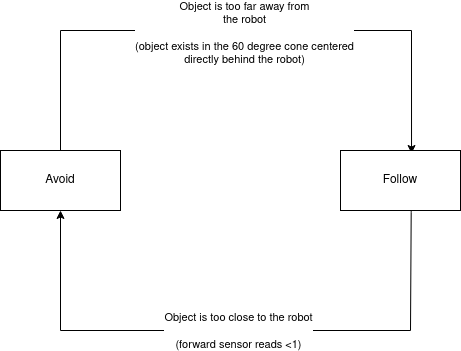
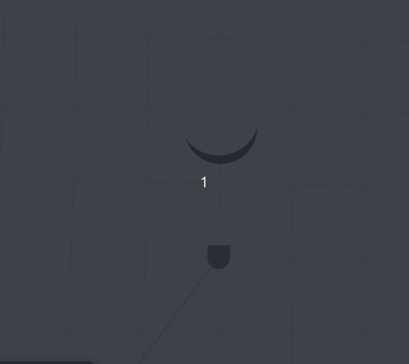

# comprobo-warm-up

In your github repository, create a markdown file called README.md to serve as documentation for your project. Your writeup should answer the following questions. We expect this writeup to be done in such a way that you are proud to include it as part of your professional portfolio. As such, please make sure to write the report so that it is understandable to an external audience. Make sure to add pictures to your report, links to Youtube videos, embedded animated Gifs (these can be recorded with the tool peek).

    - For each behavior, describe the problem at a high-level. Include any relevant diagrams that help explain your approach.  Discuss your strategy at a high-level and include any tricky decisions that had to be made to realize a successful implementation.
    - For the finite state controller, what was the overall behavior. What were the states? What did the robot do in each state? How did you combine and how did you detect when to transition between behaviors?  Consider including a state transition diagram in your writeup.
    -  How was your code structured? Make sure to include a sufficient detail about the object-oriented structure you used for your project.
    -  What if any challenges did you face along the way?
    -  What would you do to improve your project if you had more time?
    -  What are the key takeaways from this assignment for future robotic programming projects? For each takeaway, provide a sentence or two of elaboration.

# Solution Descriptions
## Teleop
The `Teleop` node is designed to accept keyboard inputs from the user and translate that to motion of the robot. My implementation of `Teleop` uses WASD as movement keys 

    - `W` stops the robot from turning and moves the robot forwards
    - `S` stops the robot from turning and moves the robot backwards 
    - `A` stops the robot's forward/backward movement and turns the robot left (relative to the direction it is currently facing) 
    - `D` stops the robot's forward/backward movement and turns the robot right (relative to the direction it is currently facing)
    - `Q` stops all forward/backward movement and turning. 

The implementation strategy for this node primarily relys on a `get_key` function, which acquires keyboard inputs from `stdin` and returns it to the script. The other piece of the puzzle is the main loop, which blocks until it receives keyboard input, then sets the robot's linear and angular velocities appropriately. 

The only special case to consider is `CTRL+C`, normally used to exit a program. Because our `get_key` function completely hijacks stdin, we need to handle a keyboard interrupt manually. We do this by catching the input and throwing it to the script.

This script achieves its purpose, in proving that I could communicate with the robot and control its motion. It has many flaws, but perhaps the biggest one is that the motion of robot isn't particularly intuitive. Generally, WASD motion *considers how long the key is held*. That is to say, I wouldn't tap `W` to make the robot move forward forever (the current behavior), but I should *hold* `W` to move. That implementation is a little bit outside of the scope of this project, though it would greatly improve the implementation of `Teleop`

## Drive-Square

The `DriveSquareNode` node is designed to drive the robot in a path that resembles a square. Note that we really did not prioritize accuracy in the implementation here, as it was designed to be practice working with ROS. 

The Node's run loop is designed to run only once, iterating through a for loop 4 times which drives the robot forward and then turns it 90 degrees to the left. Once this is done, the timer is destroyed and the robot simply stands still. 

The important calculation to mention here is how we determined how long to move and turn the robot, as we can only set linear and angular velocity and cannot set distance or turn angle. 

The distance mvoing forward or backwards is implemented by computing `distance/linear_speed`. In our case that is `1/1` resulting in a `~1m` movement forward. The angular turn time is computed similarly (angle/angular_speed) with an angular speed of 0.3 rad/s and an angle of 90 degrees (or `pi/2` rad). 

Notice, however, even in the gif, that the robot appears to be turning *almost* 90 degrees. My suspicion as to why this is the case is that the robot is incapable of immediately achieving the state that I'm setting. It takes a moment for the robot's angular acceleration to allow its velocity to reach 0.3, and therefore, the sleep timer runs out before it's truly hit 90 degrees. I spent some time playing around with a delay to fix this issue, but since it's so core to the implementation of the project, I didn't perfect it -- though it's definitely a place for improvement in the project.

## Wall-Following

### 
The `WallFollower` node is designed to follow a wall that it sees on one side.

My implementation use proportional control based on two laser scan data points. It projects a vector at 45 degrees from straight forward (called theta1) and a vector at 45 + 90, or 130 degrees from straight forward. (called theta2). It then computes the distance from those two points to the nearest wall.  Finally, to allow my robot to turn corners, it takes a measurement from straight ahead (or 0 degrees) 

Although there is certainly a version of the implementation that requires a lot of trigonometry, I simply used proportional control to ensure that the robot's behavior converges to driving parallel to the wall. The behavior is essentially as follows:

- Check if the robot sees anything directly in front of it
  - if so, turn quickly to the right!
  - otherwise turn faster to the right the larger theta2 is as compared to theta1
  - vice versa (this is implemented via subtraction)
- publish the movement message.

The tricky thing here was conceptualizing how I could essentially lazily tell my robot fix its trajectory based upon its laser scans. My initial naive implementation had multiple states that the robot was cycling through, but it could never quite follow the wall perfectly the way I wanted. After returning to the drawing board, this solution is (I feel) much more elegant.

## Person-Following

The `PersonFollower` node is designed to scan its surroundings and follow the direction where it detects an object. Furthermore, it should not quickly bump into the object. It should travel more and more slowly the closer it gets to it.

My implementation is still a little naive, but it's certainly functional. I wanted to implement as quick and easy of a solution as possible, and so I simple scanned the robot's entire surroundings and moved towards the mean of the detected points using proportional control (the closer the object got to "directly in front of the robot", the less aggressively the robot would turn). Then, I also computed the distance between the robot and the object directly in front of it and proportionally slowed it down as it approached said object.

There are a few implementation details here -- in order to reliably compute the mean for the robot, I reindexed the laser scan data I received (setting index 0 as 180). This allowed most of my points to be consecutive when the robot detected something, allowing for more reliable behavior. 

Note that it appears that my implementation would break if the object was placed directly behind the robot, but, in practice, if the object is at *all* asymmetrical, or if it's not placed *perfectly* behind the robot, eventually the proportional controller will fix the minute orientation error by turning back around.
## Obstacle Avoidance

The `ObstacleAvoider` node is supposed to avoid objects that it sees in front of it and move forward after avoiding the object

The implementation for the object avoider is essentially the opposite of the person follower, except that the goals are reversed. To do this, I changed the "goal" for our robot to placing the object at a 90 degree angle from its right side. Afterwards it'd be free to move as long as nothing entered the 180 degree range in front of it (essentially saying that anything past this range is "behind" the robot and therefore won't prevent its forward progress.)

## Finite State Controller

The `Finite State Machine` node implements both obstacle avoidance and person follower to create a robot that is permanently stuck in a limbo where it can neither leave the object behind nor touch the object on approach. The implementation has clearly defined bounds for changing states, as depicted below.

Implementing this was essentially running either the `obstacle_avoider` or the `person_follower` code, and constantly checking if it needed to switch what code it was running. The resulting behavior is a robot that is permanently rubberbanding between running away from an object and running towards it.

# Code Structures
`warmup_project/warmup_project/` is a ROS package containing all of the nodes for this project. Each "node" is an object that specifically produces the behavior for that task. Most of these nodes were publishers to the `/cmd_vel` topic and some of the future nodes were subscribers to `/scan`.

Generally, code was structured with methods that would simplify the code and make it more readable. For instance, each node has a method called `move` which is defined to make driving the robot as visually intuitive as possible. Where I use timer-based turning (see `drive_square.py`, there's also a turn method)Admittedly, for the later projects, it made sense to have the scanner simply trigger behavior and so there wasn't really a need to implement more methods. 
# Challenges

I faced most of my challenges in two places.

Firstly, it was hard familiarizing myself with the ROS tools at my disposal such as Gazebo, Rviz, bag files, etc. I'm not very familiar with the software robotics development environment and so conceptualizing what each of these tools were telling about my robot was difficult. 

Secondly, I had an undue amount of trouble understanding what the robot would need to do to solve each of these problems. My initial implementation of `wall_follower.py` was incredibly confusing and the more I worked on it, the less I understood it. In the end, I had to return to the drawing board and try to define a set of rules that would make the implementation clear and concise, resulting in the new version.
# Improvements

Because I was unfamiliar with ROS and I was working alone, my implementation for most of these nodes remain in the MVP stage. Some imrpovements I'd make:

1. Make `Teleop` require that the user hold down the key to continue the robot's behavior 
2. Develop a feedback loop for `DriveSquareNode` that would allow it turn until the odometry said that it was 90 degrees from where it started.
3. Make `WallFollower` detect walls on either side of it and dynamically select which wall to follow (based on which one is closer, for instance)
4. Allow `WallFollower` to move faster. Right now the speed is locked, as moving it faster breaks the cornering -- implementing the proportional controller I had in `PersonFollower` might fix this problem and allow my robot to move quickly until it detects a wall
5. Create a filtering system for `PersonFollower` -- right now, the system takes the average index for all detected points. That is to say, if the room was small enough for the robot to detect things on all sides, it would never move, regardless of how close or far the person was from it. 
6. Implement a "goal" coordinate for `ObstacleAvoider` that the robot attempts to navigate towards. Right now, it avoids obstacles and then moves forward, but really the point of obstacle avoidance ought to be that it allows the robot to always reach its goal location.
   
These are just a few of the many improvements that this project could use, but due to time limitations, it's just unfeasible for this current iteration.

# Takeaways

ROS, but particularly solving robotics problems computationally, is *hard*. In particular, the robots can feel slow and clunky unless you finesse the behavior in a certain way. 

Spend some time with just a pen and a paper. Draw out the geometry, draw out a potential solution, and iterate on it before ever writing a line of code. There are so many debugging tools that ROS provides, but the best one ever is comparing your paper notes to the code that you've written. I did this on the rewrite of `WallFollower`, `PersonFollower`, `ObstacleAvoider`, and `FiniteStateMachine`, and it saved me countless hours of changing constants back and forth.

Sometimes the most effective solution is also the simplest. Don't overcomplicate a system when a simpler set of rules and behaviors will solve the problem.
